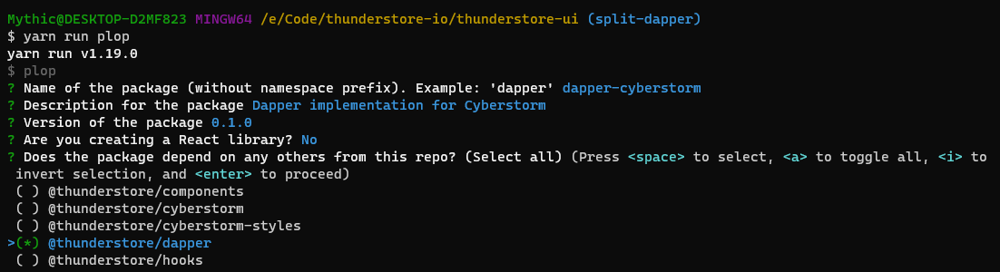

# Thunderstore UI

[](https://codecov.io/gh/thunderstore-io/thunderstore-ui)

Monorepo containing Remix frontend for [thunderstore.io](https://thunderstore.io)
and reusable UI components.

## Monorepo Setup

- [`yarn` workspaces](https://classic.yarnpkg.com/en/docs/workspaces/) manages
  the packages in the monorepo (see `packages` key in base `package.json` file)
  and handles dependency installation/deduplication.
- [`preconstruct`](https://preconstruct.tools/) automates building and linking
  the packages within the monorepo. Instead of using relative paths, local
  packages can be imported as if they were installed via a package manager.
  - Packages can be linked locally by running `yarn preconstruct dev`, but this
    is handled automatically by `postinstall` hook, so developers don't need to
    worry about it.

```
// first time setup
git clone git@github.com:thunderstore-io/thunderstore-ui.git thunderstore-ui
cd thunderstore-ui
yarn install

// start Remix dev server
yarn workspace @thunderstore/cyberstorm-remix dev
```

That's it. Changes done to `apps/cyberstorm-remix` and
`packages/cyberstorm` should both be automatically visible at
[http://localhost:3000/].

```
// production build, assumes yarn install has already been run
// build packages/* with preconstruct
yarn build

// build and start Remix prod server
yarn workspace @thunderstore/cyberstorm-remix build
yarn workspace @thunderstore/cyberstorm-remix start
```

### Troubleshooting

#### After runinng `yarn install` on Windows, you see symlinking errors

**Solution**: Enable developer mode in windows settings.
See https://github.com/preconstruct/preconstruct/issues/381 for more details

#### Yarn error `expected workspace package to exist for X`

**Solution**: Downgrade yarn to a working version by running
`yarn policies set-version 1.19.0`. See
https://github.com/yarnpkg/yarn/issues/8405 for more details.

### Adding dependencies

To add new dependencies to existing packages, simply run something like:

```
yarn workspace @thunderstore/cyberstorm add react-table @types/react-table
```

### Adding a new package

**Template**

This repository includes a templated package generation script, powered by
[plop](https://plopjs.com/documentation/). The templates can be found in
[./plop/package](./plop/package) and should be updated if the requirements
for new packages change.

Behavior of plop is controlled in a single JS file at
[./plopfile.mjs](./plopfile.mjs)

**Generating**

To actually generate a new package stub, simply run `yarn run plop` at the
root of the repository. You should be prompted with a handful of questions after
which a new package is created.



### About VS Code...

VS Code may have problem detecting installed packages in this monorepo/workspace
setup. Installing
[Monorepo Workspace extension](https://marketplace.visualstudio.com/items?itemName=folke.vscode-monorepo-workspace)
may solve them.

## Storybook

[Storybook](https://storybook.js.org/docs/react/get-started/introduction)
provides a sandbox to build UI components in isolation, without having to start
up the whole service stack. Additionally it showcases the existing components,
promoting reusability.

To start Storybook, run `yarn workspace @thunderstore/cyberstorm-storybook storybook`.
Storybook can then be accessed at [http://localhost:6006/].

When creating new components for `@thunderstore/cyberstorm`, add stories for
them by creating files under `apps/cyberstorm-storybook/stories`. See the
existing files for examples.

To upgrade Storybook when it informs you about new version being available, run
the given `npx sb@latest upgrade` command in `apps/cyberstorm-storybook`
directory.

### Chromatic

[Chromatic](https://www.chromatic.com/docs/) is used as a part of CI pipeline.
It hosts Storybook, and detects visual changes to any stories. These changes
needs to be reviewed before a related PR can be merged. The workflow is:

1. Commit and push the changes as usual. `storybook-chromatic.yml` Action
   builds and uploads a new version of our Storybook to Chromatic. Note that
   this step only fails if there's error building or uploading the Storybook -
   any changes to components are not important at this point.
2. Create a PR as usual.
3. If there were visual changes, GitHub will show a pending action: _"UI Tests
   Pending — 10 changes must be accepted as baselines."_ Clicking the *Details*
   link will take you to Chromatic, where you must review and either accept or
   reject the changes. The PR can't be merged before the changes are accepted.

`yarn workspace @thunderstore/cyberstorm-storybook chromatic` can be used to
manually upload a Storybook to Chromatic, but this seems unnecessary since we
have it automated. To use the manual method, `CHROMATIC_CYBERSTORM_TOKEN` env
variable needs to be set (in the repo it's stored as a Secret for Actions).

## Docker Compose

The build configuration for some apps is included in the
`docker-compose.build.yml` file, making building of the services simple.

**You will need to ensure all configured secrets are present before building
with docker compose.** Currently the only required secret is the `.npmrc` file,
which should include authentication to the font awesome private registry. See
[Font Awesome documentation](https://fontawesome.com/docs/web/setup/packages)
for more info on how to authenticate with npm, and then copy the `~/.npmrc` file
it generates to the `./build-secrets` directory.

**Build secrets are unsupported in the `docker-compose` python package, you must
use the built-in `docker compose` subcommand instead.**

Once the build-time secrets are available, building the services is as simple as
running:

```bash
docker compose -f docker-compose.build.yml build
```

## Testing (Docker)

Frontend tests run in Vitest browser mode (Playwright). To keep the environment consistent, use the dedicated test runner compose file instead of the dev container.

Prereqs:
- Ensure `./build-secrets/.npmrc` exists (same requirement as Docker builds).

Run tests:

```bash
yarn test:container
```

Run coverage:

```bash
yarn coverage:container
```

## pre-commit

[Pre-commit](https://pre-commit.com/) enforces code style practices in this
project. Choose your preferred
[installation method](https://pre-commit.com/#install) and then run `pre-commit
install` to enable Git hook scripts. Pre-commit will now automatically cancel
your commits if any problems are detected, and autofix them. Stage the changed
files to your commit and re-run the commit command.

Pre-commit can be disabled for a single commit with `--no-verify` option, but
note that CI also runs pre-commit and will fail if any problems are encountered
at this stage.
