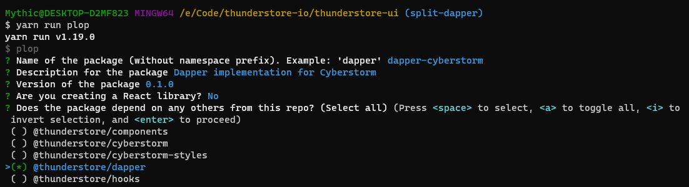

# Thunderstore UI

[](https://codecov.io/gh/thunderstore-io/thunderstore-ui)

The web frontend for [thunderstore.io](https://thunderstore.io) and its reusable UI
packages. The main app, `cyberstorm-remix`, is a
[React Router](https://reactrouter.com/) v7 app. It runs against the
[Thunderstore backend](https://github.com/thunderstore-io/Thunderstore), which
serves the API in local development.

## Contents

- [Getting started](#getting-started)
- [Monorepo layout](#monorepo-layout)
- [Storybook](#storybook)
- [Testing](#testing)
- [Working in the monorepo](#working-in-the-monorepo)
- [Building for production](#building-for-production)
- [Code style](#code-style)
- [Troubleshooting](#troubleshooting)

## Getting started

### Prerequisites

- **Node `^24.16.0`** (any 24.x from 24.16 up, set in `engines`; CI/Docker pin
  the 24.16.0 floor) and **pnpm `11.5.3`** (pinned in the
  `packageManager` field of the root `package.json`). Either enable
  [Corepack](https://nodejs.org/api/corepack.html) (`corepack enable`), which
  picks up the pinned version automatically, or install pnpm globally
  (`npm install -g pnpm@11.5.3`).
- **Font Awesome registry access.** The UI uses Font Awesome Pro icons, served from
  a private registry, so configure auth before installing (see the
  [Font Awesome docs](https://fontawesome.com/docs/web/setup/packages)):

  ```bash
  npm config set "@fortawesome:registry" https://npm.fontawesome.com/
  npm config set "//npm.fontawesome.com/:_authToken" <your-token>
  ```

### Install and run

```bash
git clone git@github.com:thunderstore-io/thunderstore-ui.git
cd thunderstore-ui
pnpm install
pnpm dev
```

`pnpm dev` starts the React Router dev server (on `:3000`) together with the build
watchers for the UI packages consumed as `dist` (`@thunderstore/cyberstorm`,
`@thunderstore/cyberstorm-theme`, `@thunderstore/ts-uploader`), so changes to the
app **and** those packages are picked up automatically.

The app expects the Thunderstore backend to be running, which serves it at
[http://thunderstore.localhost](http://thunderstore.localhost) (the dev server also
listens directly on [http://localhost:3000](http://localhost:3000)). See
[`apps/cyberstorm-remix/README.md`](apps/cyberstorm-remix/README.md) for the full
backend-plus-frontend setup.

## Monorepo layout

- **`apps/*`** — runnable applications. The main one is `cyberstorm-remix` (the
  React Router web app); `storybook` hosts the component sandbox.
- **`packages/*`** — reusable libraries, such as `@thunderstore/cyberstorm`
  (components), `@thunderstore/cyberstorm-theme` (design system), and the data and
  uploader packages.

### UI library architecture

The component UI is split into two packages with a strict one-way dependency:

- **`@thunderstore/cyberstorm`** — the self-contained component library. It owns
  the components, their API types (variant/size/modifier lists), and **structural
  CSS only**, so it renders functional-but-ugly with no theme. See
  [`packages/cyberstorm/README.md`](packages/cyberstorm/README.md).
- **`@thunderstore/cyberstorm-theme`** — a **pure-CSS skin** (colors, sizes,
  tokens, fonts) layered on top for the production look; no runtime exports. See
  [`packages/cyberstorm-theme/README.md`](packages/cyberstorm-theme/README.md).

Styles stack in three layers, each overriding the one before it:
`cyberstorm` (component layout), `cyberstorm-theme` (the skin), `nimbus`
(Remix overrides). How to declare them, and how the theme's button and input
reset fits in, is in the
[theme README](packages/cyberstorm-theme/README.md#how-it-layers-on-top-of-cyberstorm).

Two tools tie it together:

- [pnpm workspaces](https://pnpm.io/workspaces) manage the
  packages (see `pnpm-workspace.yaml` at the repo root) and handle
  dependency installation and deduplication.
- [Preconstruct](https://preconstruct.tools/) builds and links the local packages,
  so you can import them as `@thunderstore/<pkg>` instead of via relative paths.
  Linking runs automatically in the `postinstall` hook (`pnpm exec preconstruct dev`),
  so you normally don't need to run it yourself.

## Storybook

[`apps/storybook`](apps/storybook/README.md) is the sandbox for Cyberstorm
components. From the repo root:

```bash
pnpm --filter @thunderstore/storybook run storybook
```

Storybook is then available at [http://localhost:6006](http://localhost:6006).
Stories, the featuring rule, and Chromatic are documented in
[`apps/storybook/README.md`](apps/storybook/README.md).

## Testing

Frontend tests run in Vitest browser mode (Playwright). To keep the environment
consistent, use the dedicated test-runner compose file rather than the dev
container.

**Prerequisite:** `./build-secrets/.npmrc` must exist (the same Font Awesome
registry auth required for Docker builds — see
[Building for production](#building-for-production)).

```bash
pnpm run test:container       # run the tests
pnpm run coverage:container   # run with coverage
```

To type-check the whole monorepo, run `pnpm run tsc`.

## Working in the monorepo

### Adding dependencies

Add a dependency to a specific workspace:

```bash
pnpm --filter @thunderstore/cyberstorm add react-table @types/react-table
```

### Adding a new package

New packages are scaffolded with [plop](https://plopjs.com/documentation/). Run
`pnpm run plop` at the repo root and answer the prompts. The templates live in
[`./plop/package`](./plop/package) and the generator config in
[`./plopfile.mjs`](./plopfile.mjs); update them if package requirements change.



## Building for production

`pnpm run build` builds the workspace packages with Preconstruct (assuming `pnpm
install` has already run). To build and serve the app itself:

```bash
pnpm run build
pnpm --filter @thunderstore/cyberstorm-remix run build
pnpm --filter @thunderstore/cyberstorm-remix run start
```

### Docker images

Build configuration for some apps lives in `docker-compose.remix.build.yml`.
Building requires the Font Awesome private-registry credentials: follow the
[Font Awesome docs](https://fontawesome.com/docs/web/setup/packages) to generate a
`~/.npmrc`, then copy it to `./build-secrets/.npmrc`.

> Build secrets are **not** supported by the `docker-compose` Python package — use
> the built-in `docker compose` subcommand.

```bash
docker compose -f docker-compose.remix.build.yml build
```

## Code style

[pre-commit](https://pre-commit.com/) enforces code style (Prettier, Stylelint, and
ESLint). Install the hooks once with `pre-commit install`; they then run
automatically on commit and will block — and often auto-fix — style issues. Re-stage
the fixed files and commit again. CI runs the same checks, so commits that skip them
(`--no-verify`) will fail there.

## Troubleshooting

**Symlink errors after `pnpm install` on Windows.** Enable Developer Mode in Windows
settings. See
[preconstruct#381](https://github.com/preconstruct/preconstruct/issues/381).

**Wrong pnpm version.** The expected version is pinned in the `packageManager`
field of the root `package.json`. With Corepack enabled (`corepack enable`), the
pinned version is used automatically; otherwise update your global install with
`npm install -g pnpm@11.5.3`.
